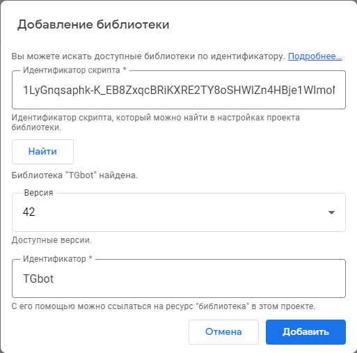

# TGbot

Google Apps Script Library для работы с [API Telegram](https://core.telegram.org/bots/api).<br/>
Работайте удобнее в GAS используя Google Таблицы.

[](https://yoomoney.ru/to/410019620244262)

ID библиотеки:
**1LyGnqsaphk-K_EB8ZxqcBRiKXRE2TY8oSHWlZn4HBje1WlmoNk51wGeg**

> Поддерживает работу с ответами doPost(e) только через Webhook.

[Баги отправлять сюда](https://t.me/nosaev_m)<br/>
Канал автора [ExceLifeHack](https://zen.yandex.ru/excelifehack)<br/>
Телеграмм канал про [Google Таблицы](https://t.me/nosaev_m)<br/>
Помощь [Google Apps & API. Скрипты, Таблицы, BigQuery, Отчеты, Автоматизация ](https://t.me/googleappsscriptrc)

## Подключение

Откройте редактор скриптов: Расширения -> Apps Script -> Библиотеки.

Заполните поля формы **Добавление библиотеки**:

- вставьте _Идентификатор скрипта библиотеки_;
- Нажмите **Найти**;
- выберите последнюю версию и **Добавить**.



## Инициализация бота

```JavaScript

//токен Telegram бота от \@BotFather.
const botToken = "<botToken>"

// ссылка на WebApp Google для работы с ответами doGet(e).
const webAppUrl = "Optional[<webAppUrl>]"

// печать URL и OPTIONS запроса при выполнении, по умочанию false.
const log_request = "Optional[<log_request>]"

const Bot = TGbot.bot(botToken, webAppUrl, log_request);

```

## Использование методов

```JavaScript

// отправка сообщения
const response = Bot.sendMessage({ chat_id: "123456", text: "Какой-то текст 😁" });

console.log(JSON.stringify(response, null, 7));

const message_id = response?.result?.message_id;

// изменение сообщения
Bot.editMessageText({
  chat_id: "123456",
  message_id: message_id ,
  text: "Изменили сообщение",
});

// удаление сообщения
Bot.deleteMessage({
  chat_id: "123456",
  message_id: message_id,
});

// отправка фото
Bot.sendPhoto({
    chat_id: "123456",
    photo: "url фото",
    caption: "Отправка фото",
  });

// отправка группы медиа (фото)
const data = [
  ["url фото", "Подпись 1"],
  ["url фото", "Подпись 2"],
  ["url фото", "Подпись 3"],
].map((item) => TGbot.inputMediaPhoto({ media: item[0], caption: item[1] }));

  console.log(JSON.stringify(data, null, 7));
  Bot.sendMediaGroup({ chat_id: "123456", media: data });

```

## Кнопки клавиатуры

```JavaScript

const Keyboard = TGbot.keyboard();
const Key = TGbot.key();

const keys = ["1", "2", "3", "4"];
const KEYBOARD_REPLY = Keyboard.make([keys, "5"], { columns: 2 }).reply();

Bot.sendMessage({
  chat_id: chat_id,
  text: "Отправили клавиатуру 👇",
  reply_markup: KEYBOARD_REPLY,
});

const KEYBOARD_INLINE = Keyboard.make(
  [Key.url("✅ Нажми меня", "https://www.google.ru")],
  { columns: 1 }
).inline();

Bot.sendMessage({
  chat_id: chat_id,
  text: "А вот inline клавиатура 👇",
  reply_markup: KEYBOARD_INLINE,
});

Bot.sendMessage({
  chat_id: chat_id,
  text: "Удалить клавиатуру 😎",
  reply_markup: Keyboard.remove(),
});

```

## Webhook - doPost(e)

```JavaScript

const botToken = "<botToken>"
const webAppUrl = "<webAppUrl>"
const Bot = TGbot.bot(botToken, webAppUrl);

function doPost(e) {
  if (!e || !e.postData || !e.postData.contents) return;

  //парсим объет, который пришёл
  const contents = JSON.parse(e.postData.contents);
  const debug =
    ss.getSheetByName("Debug") || ss.insertSheet("Debug").setTabColor("RED");
  debug.getRange(1, 1).setValue(JSON.stringify(contents, null, 7));

  try {
    if (contents.message) {
      const msg = contents.message;
      const text = msg.text;
      const chat_id = msg.from.id;

      if (TGbot.isBotCommandMessage(msg)) {
        if (["/start"].includes(text))
          Bot.sendMessage({ chat_id: chat_id, text: `Привет!` });
        else if (["/myid"].includes(text))
          Bot.replyMessage({
            message: msg,
            text: `Твой Telegram ID: ${chat_id}`,
          });
        else if (!["/start", "/myid"].includes(text))
          Bot.answerMessage({
            message: msg,
            text: `Я не знаю такой команды ${text} 😕, попробуй еще раз.`,
          });
      } else if (["фото"].includes(text.toLowerCase())) {
        const data = [
          ["url фото", "Подпись 1"],
          ["url фото", "Подпись 2"],
          ["url фото", "Подпись 3"],
        ].map(
          (item) => TGbot.inputMediaPhoto({ media: item[0], caption: item[1] })
        );

        return Bot.sendMediaGroup({ chat_id: chat_id, media: data });
      } else if (["видео"].includes(text.toLowerCase()))
        return Bot.sendVideo({ chat_id: chat_id, video: "url видео" });
      else
        return Bot.sendMessage({
          chat_id: chat_id,
          text: `Не понимаю ¯\_(ツ)_/¯`,
        });
    }
  } catch (err) {
    console.log(err.stack);
  }
}

```

## Методы библиотеки (официальные):

- [setWebhook](https://core.telegram.org/bots/api#setwebhook) метод, для указания URL-адреса и получения входящих обновлений через исходящий веб-перехватчик.
- [deleteWebhook](https://core.telegram.org/bots/api#deletewebhook) метод, для удаления интеграции с веб-перехватчиком.
- [getWebhookInfo](https://core.telegram.org/bots/api#getwebhookinfo) метод, для получения текущего статуса веб-перехватчика.
- [getMe](https://core.telegram.org/bots/api#getme) метод проверки токена аутентификации вашего бота.
- [setMyDefaultAdministratorRights](https://core.telegram.org/bots/api#setmydefaultadministratorrights) метод, для измения прав администратора по умолчанию, запрашиваемые ботом, когда он добавляется в качестве администратора в группы или каналы.
- [getMyDefaultAdministratorRights](https://core.telegram.org/bots/api#getmydefaultadministratorrights) метод, для получения текущих прав администратора бота по умолчанию.
- [setMyCommands](https://core.telegram.org/bots/api#setmycommands) метод, для установки списока команд бота.
- [getMyCommands](https://core.telegram.org/bots/api#getmycommands) метод, для получения списка команд бота.
- [deleteMyCommands](https://core.telegram.org/bots/api#deletemycommands) метод, для удаления списока команд бота.
- [getChat](https://core.telegram.org/bots/api#getchat) используйте этот метод для получения актуальной информации о чате (текущее имя пользователя для разговоров один на один, текущее имя пользователя, группы или канала и т. д.).
- [getChatAdministrators](https://core.telegram.org/bots/api#getchatadministrators) метод, для получения списка администраторов в чате.
- [getChatMemberCount](https://core.telegram.org/bots/api#getchatmembercount) метод, для получения количества участников в чате.
- [getChatMember](https://core.telegram.org/bots/api#getchatmember) метод, получения информации об участнике чата.
- [banChatMember](https://core.telegram.org/bots/api#banchatmember) метод, для блокировки пользователя в группе, супергруппе или канале.
- [setChatPermissions](https://core.telegram.org/bots/api#setchatpermissions) метод, для установки разрешений чата по умолчанию для всех участников.
- [restrictChatMember](https://core.telegram.org/bots/api#restrictchatmember) метод, чтобы ограничить пользователя в супергруппе.
- [leaveChat](https://core.telegram.org/bots/api#leavechat) используйте этот метод чтобы ваш бот покинул группу, супергруппу или канал.
- [sendMessage](https://core.telegram.org/bots/api#sendmessage) метод, для отправки текстовых сообщений.
- [copyMessage](https://core.telegram.org/bots/api#copymessage) метод, для копирования сообщения.
- [deleteMessage](https://core.telegram.org/bots/api#deletemessage) метод, для удаления сообщения.
- [editMessageText](https://core.telegram.org/bots/api#editmessagetext) метод, для редактирования текстовых и игровых сообщений.
- [editMessageCaption](https://core.telegram.org/bots/api#editmessagecaption) метод, для редактирования подписей к сообщениям.
- [editMessageMedia](https://core.telegram.org/bots/api#editmessagemedia) метод, для редактирования анимации, аудио, документа, фото или видео сообщения.
- [editMessageReplyMarkup](https://core.telegram.org/bots/api#editmessagereplymarkup)
- [sendPhoto](https://core.telegram.org/bots/api#editmessagereplymarkup) метод, для отправки фотографий.
- [sendDocument](https://core.telegram.org/bots/api#senddocument) метод, для отправки общих файлов.
- [sendVideo](https://core.telegram.org/bots/api#sendvideo) метод, для отправки видео.
- [sendAudio](https://core.telegram.org/bots/api#sendaudio) метод, для отправки отправки аудиофайлов.
- [sendMediaGroup](https://core.telegram.org/bots/api#sendmediagroup) метод, отправки группы фотографий, видео, документов или аудио в виде альбома.
- [sendSticker](https://core.telegram.org/bots/api#sendsticker) метод, отправки статических стикеров .WEBP, анимированных .TGS или видео .WEBM.
- [getStickerSet](https://core.telegram.org/bots/api#getstickerset) метод, для получения набора наклеек по названию набора.
- [answerCallbackQuery](https://core.telegram.org/bots/api#answercallbackquery) метод, для отправки ответов на запросы обратного вызова, отправленные со встроенной клавиатуры.
- [getFile](https://core.telegram.org/bots/api#getfile) метод, для получения основной информации о файле и подготовки его к загрузке.

## Неофициальные методы:

- getPath метод, для получения пути к файлу.
- getFileDownloadUrl метод, получения ссылки на скачивание файла.
- answerMessage ответ по from.id на получнное сообщение. Передать объект message в качестве первого аргумента.
- replyMessage ответ по message_id на получнное сообщение. Передать объект message в качестве первого аргумента.

## Copyright & License

Copyright (©) 2022 by [Mikhail Nosaev](https://github.com/Guf-Hub)

Настоящим предоставляется бесплатное разрешение любому лицу, получившему копию этого программного обеспечения и связанных с ним файлов документации («Программное обеспечение»), работать с Программным обеспечением без ограничений, включая, помимо прочего, права на использование, копирование, изменение, слияние. публиковать, распространять, сублицензировать и/или продавать копии Программного обеспечения, а также разрешать лицам, которым предоставляется Программное обеспечение, делать это при соблюдении следующих условий:

Приведенное выше уведомление об авторских правах и это уведомление о разрешении должны быть включены во все копии или существенные части Программного обеспечения.

ПРОГРАММНОЕ ОБЕСПЕЧЕНИЕ ПРЕДОСТАВЛЯЕТСЯ «КАК ЕСТЬ», БЕЗ КАКИХ-ЛИБО ГАРАНТИЙ, ЯВНЫХ ИЛИ ПОДРАЗУМЕВАЕМЫХ, ВКЛЮЧАЯ, ПОМИМО ПРОЧЕГО, ГАРАНТИИ КОММЕРЧЕСКОЙ ПРИГОДНОСТИ, ПРИГОДНОСТИ ДЛЯ ОПРЕДЕЛЕННОЙ ЦЕЛИ И НЕНАРУШЕНИЯ ПРАВ. НИ ПРИ КАКИХ ОБСТОЯТЕЛЬСТВАХ АВТОРЫ ИЛИ ОБЛАДАТЕЛИ АВТОРСКИМ ПРАВОМ НЕ НЕСУТ ОТВЕТСТВЕННОСТИ ЗА ЛЮБЫЕ ПРЕТЕНЗИИ, УЩЕРБ ИЛИ ИНУЮ ОТВЕТСТВЕННОСТЬ, БУДУТ СВЯЗАННЫЕ С ДОГОВОРОМ, ДЕЛОМ ИЛИ ИНЫМ ОБРАЗОМ, ВОЗНИКАЮЩИЕ ИЗ ПРОГРАММНОГО ОБЕСПЕЧЕНИЯ ИЛИ ИСПОЛЬЗОВАНИЯ ИЛИ ИНЫХ СДЕЛОК В СВЯЗИ С ПРОГРАММНЫМ ОБЕСПЕЧЕНИЕМ ИЛИ ИСПОЛЬЗОВАНИЕМ ПРОГРАММНОГО ОБЕСПЕЧЕНИЯ.
